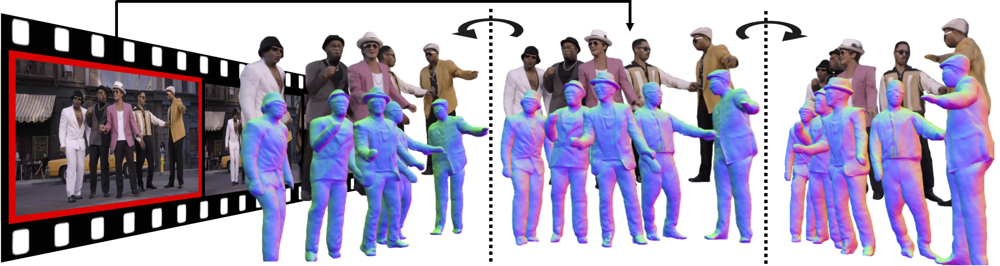

# MultiPly: Reconstruction of Multiple People from Monocular Video in the Wild

## [Paper](https://arxiv.org/pdf/2406.01595) | [Video Youtube](https://youtu.be/r9giQPUp1Gw) | [Project Page](https://eth-ait.github.io/MultiPly/) | [MMM Dataset](https://multiply.ait.ethz.ch/)


Official Repository for CVPR 2024 paper [*MultiPly: Reconstruction of Multiple People from Monocular Video in the Wild*](). 
<p align="center">
 
</p>

<br><br>

## Getting Started with Ubuntu

### 1. Install Git (only once):
```bash
sudo apt update
sudo apt install git
```

<br><br>

### 2. Install Docker (only once):
```bash
sudo apt-get update
sudo apt-get install -y ca-certificates curl gnupg lsb-release
sudo install -m 0755 -d /etc/apt/keyrings
curl -fsSL https://download.docker.com/linux/ubuntu/gpg | sudo gpg --dearmor -o /etc/apt/keyrings/docker.gpg
echo "deb [arch=$(dpkg --print-architecture) signed-by=/etc/apt/keyrings/docker.gpg] https://download.docker.com/linux/ubuntu $(lsb_release -cs) stable" | sudo tee /etc/apt/sources.list.d/docker.list > /dev/null
sudo apt-get install -y docker-ce docker-ce-cli containerd.io docker-buildx-plugin docker-compose-plugin
```

<br><br>

### 3. Docker setting (only once):
```bash
sudo apt install -y nvidia-container-toolkit
sudo nvidia-ctk runtime configure --runtime=docker
sudo systemctl restart docker
```

<br><br>

### 4. Clone the repository (only once):
```bash
git clone https://github.com/Koki1111a/MultiPly.git
cd MultiPly
```

<br><br>

### 5. Download SMPL model (only once):
Click [here](https://download.is.tue.mpg.de/download.php?domain=smpl&sfile=SMPL_python_v.1.1.0.zip) to download.

<br><br>

### 6. Move SMPL model to the corresponding places (only once):
Replace '/path_to_smpl_models' with the actual path where your SMPL models are stored.
```bash
mkdir code/lib/smpl/smpl_model/
mv /path_to_smpl_models/basicmodel_f_lbs_10_207_0_v1.1.0.pkl code/lib/smpl/smpl_model/SMPL_FEMALE.pkl
mv /path_to_smpl_models/basicmodel_m_lbs_10_207_0_v1.1.0.pkl code/lib/smpl/smpl_model/SMPL_MALE.pkl
mv /path_to_smpl_models/basicmodel_neutral_lbs_10_207_0_v1.1.0.pkl code/lib/smpl/smpl_model/SMPL_NEUTRAL.pkl
```

<br><br>

### 7. Set up swap (only once):
```bash
sudo swapoff /swapfile 2>/dev/null || true
sudo rm /swapfile 2>/dev/null || true
sudo fallocate -l 8G /swapfile
sudo chmod 600 /swapfile
sudo mkswap /swapfile
sudo swapon /swapfile
```

<br><br>

### 8. Create the container (only once):
Check the GPU model name using a command, then verify the corresponding [CUDA Compute Capability version](https://developer.nvidia.com/cuda-gpus).
```bash
nvidia-smi --query-gpu=name --format=csv,noheader
```
Replace "x.x" with the appropriate CUDA Compute Capability version for your GPU (e.g., "8.6").
```bash
docker build --build-arg TORCH_CUDA_ARCH_LIST="x.x" -t multiply .
docker create --name multiply multiply
```

<br><br>

### 9. Start the container:
```bash
docker run --gpus all -it -v $(pwd):/MultiPly multiply
```

<br><br>

### 10. 