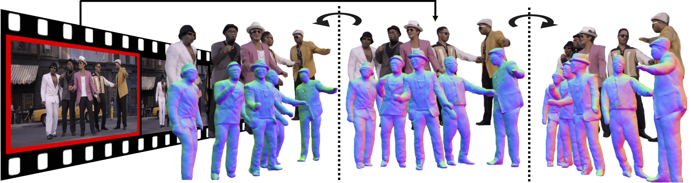

# MultiPly: Reconstruction of Multiple People from Monocular Video in the Wild

## [Paper](https://arxiv.org/pdf/2406.01595) | [Video Youtube](https://youtu.be/r9giQPUp1Gw) | [Project Page](https://eth-ait.github.io/MultiPly/) | [MMM Dataset](https://multiply.ait.ethz.ch/)


Official Repository for CVPR 2024 paper [*MultiPly: Reconstruction of Multiple People from Monocular Video in the Wild*](). 
<p align="center">
 
</p>

<br><br>

## Getting Started (for Ubuntu)

### 1. Git のインストール (初回のみ):
```bash
sudo apt update
sudo apt install git
```

### 2. Docker のインストール (初回のみ):
```bash
sudo apt-get update
sudo apt-get install -y ca-certificates curl gnupg lsb-release
sudo install -m 0755 -d /etc/apt/keyrings
curl -fsSL https://download.docker.com/linux/ubuntu/gpg | sudo gpg --dearmor -o /etc/apt/keyrings/docker.gpg
echo "deb [arch=$(dpkg --print-architecture) signed-by=/etc/apt/keyrings/docker.gpg] https://download.docker.com/linux/ubuntu $(lsb_release -cs) stable" | sudo tee /etc/apt/sources.list.d/docker.list > /dev/null
sudo apt-get install -y docker-ce docker-ce-cli containerd.io docker-buildx-plugin docker-compose-plugin
```

### 3. プログラムのクローン (初回のみ):
```bash
git clone https://github.com/Koki1111a/MultiPly.git
cd MultiPly
```

### 4. Download [SMPL model](https://download.is.tue.mpg.de/download.php?domain=smpl&sfile=SMPL_python_v.1.1.0.zip) and move them to the corresponding places (初回のみ):
```bash
mkdir code/lib/smpl/smpl_model/
mv /path_to_smpl_models/basicmodel_f_lbs_10_207_0_v1.1.0.pkl code/lib/smpl/smpl_model/SMPL_FEMALE.pkl
mv /path_to_smpl_models/basicmodel_m_lbs_10_207_0_v1.1.0.pkl code/lib/smpl/smpl_model/SMPL_MALE.pkl
mv /path_to_smpl_models/basicmodel_neutral_lbs_10_207_0_v1.1.0.pkl code/lib/smpl/smpl_model/SMPL_NEUTRAL.pkl
```

### 5. コンテナを作成する (初回のみ):
```bash
docker build -t multiply . # イメージのビルド
docker create --name multiply multiply # コンテナの作成
```

### 6. コンテナの起動:
```bash
docker start -ai multiply
```

### 6. 